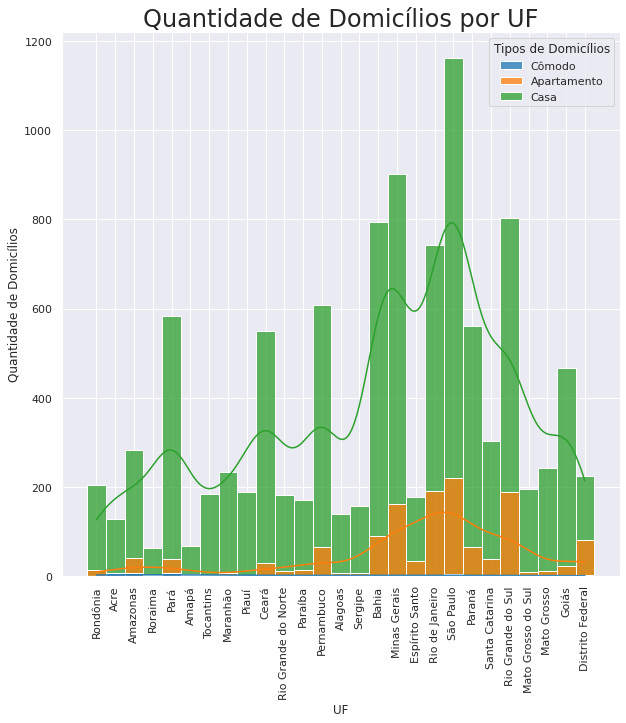
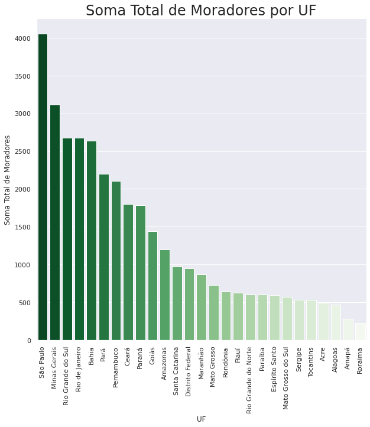
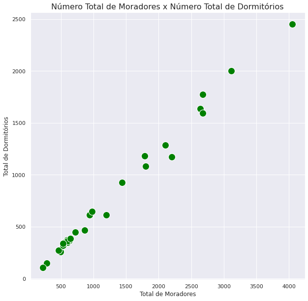

# Workshop Fundamentos da Matemática para Análise de Dados | EBAC

## [Dia 1: Fundamentos da Matemática](https://github.com/andreferibeiro/workshop_dados_ebac/blob/main/workshop_dados_ebac_dia1.ipynb)
* PEMDAS: Parêntesis, Exponenciação, Multiplicação, Divisão, Adição e Subtração
* Principais tipos de Dados: Numéricos, cadeia de caracteres, buleanos
* Conversão de dados: Como consultar e modificar o tipo de um dado
* Amostra & População
* Variáveis Quantitativas e Qualitativas

## [Dia 2: Principais Operações](https://github.com/andreferibeiro/workshop_dados_ebac/blob/main/workshop_ebac_dados_dia2.ipynb)
* Medidas de Centralidade: Moda, média e mediana.
* Desvio padrão e Variância.
* Principais visualizações de Dados
* Desafio para exercitar seus novos conhecimentos

## [Dia 3: Análise e Desafio](https://github.com/andreferibeiro/workshop_dados_ebac/blob/main/desafio_ebac_dados_andreferibeiro.ipynb)
* Acompanhe a análise ao vivo dos desafios enviados pelos participantes
* Tire todas as suas dúvidas sobre o workshop com o professor

